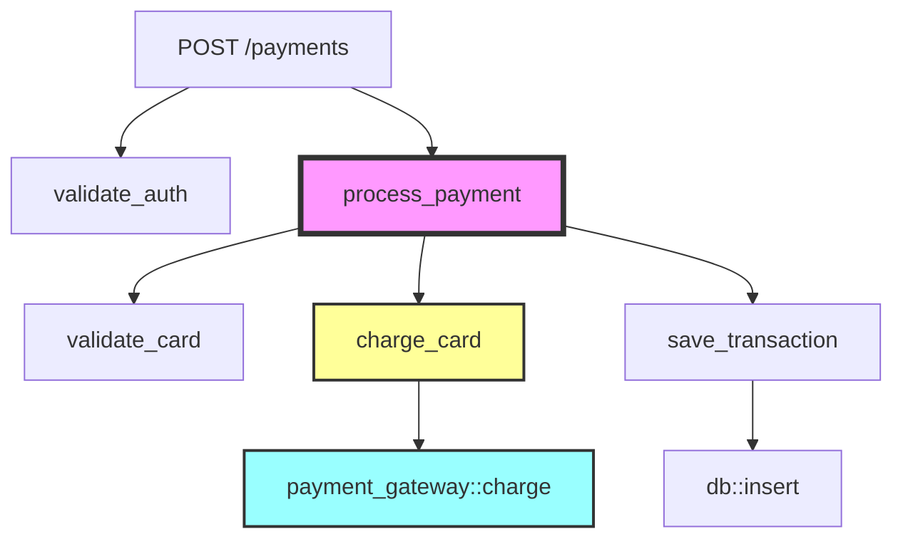

# instrument-rs

A comprehensive Rust library and CLI tool for code instrumentation, analysis, and testing. It provides automated code analysis for test coverage tracking, mutation testing, and observability instrumentation (tracing, logging, metrics). The tool analyzes execution flows from endpoints to identify critical paths and suggests optimal instrumentation points.

## 🎯 Overview

`instrument-rs` is a powerful code analysis and instrumentation tool that helps you:

**Code Analysis & Instrumentation:**
- Build comprehensive call graphs to understand code structure
- Trace execution paths from HTTP/gRPC endpoints
- Identify critical business logic and external service calls
- Detect patterns in code (database operations, API calls, error handling)
- Score existing instrumentation quality

**Testing & Quality:**
- Generate mutation tests to evaluate test suite effectiveness
- Track test coverage with detailed reporting
- Apply various mutation operators (arithmetic, comparison, logical)
- Produce coverage reports in multiple formats (HTML, JSON, LCOV)

**Observability:**
- Suggest optimal points for tracing, logging, and metrics
- Auto-detect web frameworks (Axum, Actix-web, Rocket, Tonic)
- Generate instrumentation code automatically
- Optimize telemetry costs and ensure compliance

## ✨ Features

### Core Capabilities
- **AST-based Analysis**: Deep code analysis using Rust's syntax tree
- **Call Graph Construction**: Build comprehensive function call graphs with cross-crate resolution
- **Pattern Recognition**: Configurable pattern matching for code constructs
- **Framework Detection**: Auto-detect web frameworks (Axum, Actix-web, Rocket, Tonic)
- **Parallel Processing**: Fast analysis with multi-threaded execution

### Instrumentation & Testing
- **Coverage Tracking**: Instrument code for test coverage analysis
- **Mutation Testing**: Apply mutations to evaluate test effectiveness
- **Multiple Mutation Operators**: Arithmetic, comparison, logical, and more
- **Configurable Thresholds**: Set coverage and mutation score requirements
- **Incremental Analysis**: Analyze only changed files for faster CI/CD

### Reporting & Visualization
- **Multiple Output Formats**: JSON, HTML, Mermaid, DOT, Console
- **Visual Call Graphs**: Generate interactive diagrams
- **Detailed Reports**: Coverage reports with source code highlighting
- **Quality Scoring**: Evaluate and score existing instrumentation
- **Cost Analysis**: Estimate telemetry overhead and costs

## 📦 Installation

```bash
# Install from crates.io (coming soon)
cargo install instrument-rs

# Build from source
git clone https://github.com/nwiizo/instrument-rs
cd instrument-rs
cargo build --release
```

## 🚀 Quick Start

```bash
# Basic usage - analyze current directory
instrument-rs .

# Trace from endpoints with visual output
instrument-rs . --trace-from-endpoints --format mermaid

# Analyze specific framework
instrument-rs . --framework axum --trace-from-endpoints

# Generate JSON report for CI/CD integration
instrument-rs . --format json > instrumentation-report.json
```

## 📊 Example Output

### Endpoint-based Analysis

```
Tracing from HTTP endpoints:
────────────────────────────────────────────────────────────
POST /api/v1/payments -> process_payment_handler
├── validate_auth_token (auth.rs:45)
│   └── verify_jwt (jwt.rs:23)
├── parse_payment_request (models.rs:89)
├── process_payment (payment.rs:123) ⚠️ Critical Path
│   ├── validate_card (validation.rs:45)
│   ├── check_fraud (fraud.rs:78) ⚠️ External Service
│   ├── charge_card (payment_gateway.rs:90) ⚠️ External Service
│   └── save_transaction (db.rs:234) ⚠️ Database Operation
└── send_confirmation (notification.rs:56) ⚠️ External Service

Critical paths identified: 8
External service calls: 4
Database operations: 2
```

### Visual Call Graph (Mermaid)



## 🔧 Command Line Options

```bash
instrument-rs [OPTIONS] [PATH] [COMMAND]

ARGUMENTS:
    [PATH]                           Path to analyze [default: .]

OPTIONS:
    -t, --threshold <FLOAT>          Detection threshold (0.0-1.0) [default: 0.8]
    -m, --min-lines <NUM>            Minimum function lines [default: 3]
    --trace-from-endpoints           Trace execution paths from entry points
    --framework <NAME>               Framework [axum|actix|rocket|tonic|auto]
    --max-depth <NUM>                Maximum call depth to analyze [default: 10]
    --include-tests                  Include test endpoints in analysis
    --show-call-graph                Display visual call graph
    --patterns <FILE>                Custom patterns file
    -f, --format <FORMAT>            Output format [human|json|dot|mermaid]
    --filter-path <REGEX>            Only show paths matching regex
    -c, --config <FILE>              Configuration file path
    -v, --verbose                    Increase verbosity (use multiple times)
    -h, --help                       Print help information
    -V, --version                    Print version information

COMMANDS:
    analyze                          Analyze code and suggest instrumentation points
    init                             Initialize a new configuration file
    generate                         Generate instrumentation code
    help                             Print this message or the help of subcommands
```

## 🤖 AI Integration

This tool is designed to work seamlessly with AI assistants:

```
`instrument-rs . --trace-from-endpoints` analyzes Rust code endpoints to trace 
critical execution paths and detect instrumentation points. Use this to create 
comprehensive observability implementation plans. Run `instrument-rs -h` for options.
```

## 📚 Documentation

- [Architecture Guide](docs/architecture.md) - Detailed design and architecture
- [Configuration Reference](instrument-rs.toml.example) - All configuration options
- [API Documentation](https://docs.rs/instrument-rs) - Full API reference (when published)
- [Changelog](CHANGELOG.md) - Version history and changes

## 📂 Project Structure

```
instrument-rs/
├── src/
│   ├── main.rs              # CLI entry point
│   ├── lib.rs               # Library interface
│   ├── ast/                 # AST analysis and manipulation
│   │   ├── analyzer.rs      # Core analysis functionality
│   │   ├── visitor.rs       # AST traversal utilities
│   │   └── helpers.rs       # AST manipulation helpers
│   ├── call_graph/          # Call graph construction
│   │   ├── builder.rs       # Graph builder
│   │   ├── graph.rs         # Graph data structure
│   │   └── resolver.rs      # Symbol resolution
│   ├── framework/           # Framework detection
│   │   ├── detector.rs      # Auto-detection logic
│   │   └── web/             # Web framework adapters
│   │       ├── axum.rs      # Axum support
│   │       ├── actix.rs     # Actix-web support
│   │       ├── rocket.rs    # Rocket support
│   │       └── tonic.rs     # Tonic/gRPC support
│   ├── patterns/            # Pattern matching system
│   │   ├── matcher.rs       # Pattern matching engine
│   │   └── pattern_set.rs   # Pattern definitions
│   ├── instrumentation/     # Code instrumentation
│   │   ├── coverage.rs      # Coverage tracking
│   │   ├── mutation.rs      # Mutation testing
│   │   └── transform.rs     # Code transformation
│   ├── scoring/             # Quality scoring
│   │   ├── analyzer.rs      # Scoring algorithms
│   │   └── instrumentation.rs # Instrumentation scoring
│   ├── output/              # Output formatting
│   │   ├── json.rs          # JSON formatter
│   │   ├── mermaid.rs       # Mermaid diagrams
│   │   └── tree.rs          # Tree visualization
│   └── config.rs            # Configuration handling
├── docs/
│   ├── architecture.md      # Architecture documentation
│   └── instrumentation_scoring.md # Scoring system details
├── examples/                # Example usage
├── tests/                   # Integration tests
└── instrument-rs.toml.example # Configuration template
```

## 🛠️ Development

### Building

```bash
# Build the project
cargo build

# Build with optimizations
cargo build --release

# Run the CLI tool
cargo run -- . --trace-from-endpoints
```

### Testing

```bash
# Run all tests
cargo test

# Run with output
cargo test -- --nocapture

# Run specific test
cargo test test_name
```

### Code Quality

```bash
# Format code
cargo fmt

# Run linter
cargo clippy -- -D warnings

# Generate documentation
cargo doc --no-deps --open
```

## 🚧 Features in Development

Based on real-world production needs:

### High Priority
- **Existing Instrumentation Detection**: Analyze current tracing/logging quality
- **Differential Analysis**: Suggest incremental improvements to existing code
- **Coverage Metrics**: Calculate observability coverage by module/criticality

### Medium Priority
- **Performance Impact Estimation**: Predict overhead of instrumentation
- **Team Standardization**: Enforce naming conventions and required fields
- **Cost Optimization**: Estimate and optimize telemetry costs (DataDog, CloudWatch)

### Low Priority
- **Phased Rollout Plans**: Generate step-by-step implementation guides
- **Dynamic Configuration**: Runtime instrumentation adjustments
- **Compliance Checking**: GDPR, PCI-DSS, HIPAA data handling validation

## Contributing

Contributions are welcome! Please feel free to submit a Pull Request.

### Development Guidelines

1. Run `cargo fmt` before committing
2. Ensure `cargo clippy` passes with no warnings
3. Add tests for new functionality
4. Update documentation as needed

## License

This project is licensed under the MIT License - see the [LICENSE](LICENSE) file for details.

## Authors

- nwiizo

## Repository

[https://github.com/nwiizo/instrument-rs](https://github.com/nwiizo/instrument-rs)