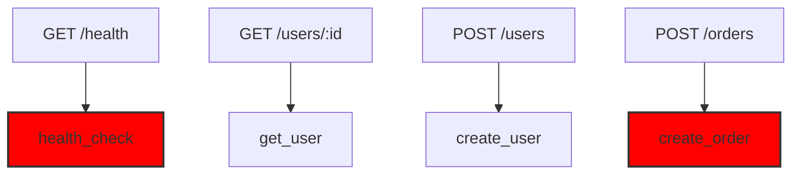

# instrument-rs

A Rust CLI tool for analyzing code and detecting optimal instrumentation points for observability (tracing, logging, metrics). It traces execution flows from HTTP/gRPC endpoints to identify critical paths that need monitoring, helping teams implement comprehensive observability strategies.

## 🎯 Overview

`instrument-rs` is a code analysis tool focused on observability that helps you:

**Smart Dependency-Aware Analysis:**
- Analyze `Cargo.toml` to understand project dependencies
- Context-aware detection based on used crates (sqlx, reqwest, redis, etc.)
- Reduce false positives by understanding what your project actually uses
- Auto-detect web frameworks (Axum, Actix-web, Rocket, Tonic)

**Call Graph & Path Tracing:**
- Build comprehensive call graphs to understand code structure
- Trace execution paths from HTTP/gRPC endpoints
- Identify critical business logic and external service calls
- Detect patterns in code (database operations, API calls, error handling)

**Instrumentation Detection:**
- Find existing `#[instrument]` macros and manual span creation
- Identify gaps in current observability coverage
- Suggest optimal points for tracing, logging, and metrics
- Score existing instrumentation quality

## ✨ Features

### Smart Analysis (Phase 2)
- **Dependency-Aware Detection**: Analyzes `Cargo.toml` to understand what crates your project uses
- **Context-Based Matching**: Prioritizes patterns based on detected dependencies
- **False Positive Reduction**: `get_user` won't be flagged as HTTP client when you use sqlx
- **Accurate Line Numbers**: Precise source locations using proc-macro2 span-locations

### Core Capabilities
- **AST-based Analysis**: Deep code analysis using Rust's syntax tree
- **Call Graph Construction**: Build comprehensive function call graphs
- **Pattern Recognition**: Configurable pattern matching for code constructs
- **Framework Detection**: Auto-detect web frameworks (Axum, Actix-web, Rocket, Tonic)
- **Existing Instrumentation Detection**: Find `#[instrument]` macros and manual spans

### Reporting & Visualization
- **Multiple Output Formats**: JSON, Mermaid, DOT, Console
- **Visual Call Graphs**: Generate interactive diagrams
- **Quality Scoring**: Evaluate and score existing instrumentation
- **Critical Path Identification**: Highlight paths needing observability

## 📦 Installation

```bash
# Install from crates.io (coming soon)
cargo install instrument-rs

# Build from source
git clone https://github.com/nwiizo/instrument-rs
cd instrument-rs
cargo build --release
```

## 🚀 Quick Start

```bash
# Basic usage - analyze current directory
instrument-rs .

# Trace from endpoints with visual output
instrument-rs . --trace-from-endpoints --format mermaid

# Analyze specific framework
instrument-rs . --framework axum --trace-from-endpoints

# Generate JSON report for CI/CD integration
instrument-rs . --format json > instrumentation-report.json
```

## 📊 Example Output

### Human-Readable Output (Default)

```
instrument-rs Analysis Results
═══════════════════════════════

📊 Statistics
   Files analyzed:     1
   Functions found:    46
   Lines of code:      688
   Endpoints:          8
   Instrumentation:    8 points

🔗 Detected Endpoints
   GET /health → health_check
      src/main.rs:661
   GET /users/:id → get_user
      src/main.rs:662
   POST /users → create_user
      src/main.rs:663
   POST /orders → create_order
      src/main.rs:666

📍 Instrumentation Points
   [Critical] health_check (HTTP/gRPC Endpoint)
      Reason: GET endpoint handler
      Suggested span: get_health
      Location: src/main.rs:661

   [Critical] create_order (HTTP/gRPC Endpoint)
      Reason: POST endpoint handler
      Suggested span: post_orders
      Location: src/main.rs:666
```

### JSON Output (`--format json`)

```json
{
  "endpoints": [
    {
      "framework": "axum",
      "handler": "health_check",
      "location": { "file": "src/main.rs", "line": 661 },
      "method": "GET",
      "path": "/health"
    }
  ],
  "instrumentation_points": [
    {
      "file": "src/main.rs",
      "function": "health_check",
      "kind": "Endpoint",
      "priority": "Critical",
      "reason": "GET endpoint handler",
      "suggested_span_name": "get_health"
    }
  ],
  "stats": {
    "endpoints_count": 8,
    "instrumentation_points": 8,
    "total_files": 1,
    "total_functions": 46
  }
}
```

### Mermaid Output (`--format mermaid`)



## 🔧 Command Line Options

```bash
instrument-rs [OPTIONS] [PATHS]... [COMMAND]

ARGUMENTS:
    [PATHS]...                       Paths to analyze [default: .]

OPTIONS:
    --trace-from-endpoints           Trace from HTTP/gRPC endpoints
    --framework <FRAMEWORK>          Framework [auto|axum|actix|rocket|tonic]
    -f, --format <FORMAT>            Output format [human|json|mermaid]
    --filter-path <REGEX>            Filter paths by pattern (regex)
    --max-depth <NUM>                Maximum call graph depth [default: 10]
    --threshold <FLOAT>              Detection threshold (0.0-1.0) [default: 0.8]
    --include-tests                  Include test functions in analysis
    --patterns <FILE>                Custom patterns file
    -o, --output <FILE>              Output file (default: stdout)
    -h, --help                       Print help information
    -V, --version                    Print version information

COMMANDS:
    init                             Initialize configuration file
    check                            Check instrumentation coverage (for CI)
    help                             Print this message or the help of subcommands
```

## 🤖 AI Integration

This tool is designed to work seamlessly with AI assistants:

```
`instrument-rs . --trace-from-endpoints` analyzes Rust code endpoints to trace 
critical execution paths and detect instrumentation points. Use this to create 
comprehensive observability implementation plans. Run `instrument-rs -h` for options.
```

## 📚 Documentation

- [Architecture Guide](docs/architecture.md) - Detailed design and architecture
- [Configuration Reference](instrument-rs.toml.example) - All configuration options
- [API Documentation](https://docs.rs/instrument-rs) - Full API reference (when published)
- [Changelog](CHANGELOG.md) - Version history and changes

## 📂 Project Structure

```
instrument-rs/
├── src/
│   ├── main.rs              # CLI entry point
│   ├── lib.rs               # Library interface and Analyzer
│   ├── config.rs            # Configuration handling
│   ├── error.rs             # Error types
│   ├── dependencies.rs      # Cargo.toml dependency analysis
│   ├── ast/                 # AST analysis
│   │   ├── analyzer.rs      # Core AST analysis
│   │   ├── visitor.rs       # AST traversal with spans
│   │   └── helpers.rs       # AST manipulation helpers
│   ├── call_graph/          # Call graph construction
│   │   ├── builder.rs       # Graph builder
│   │   ├── graph.rs         # Graph data structure
│   │   └── resolver.rs      # Symbol resolution
│   ├── detector/            # Instrumentation detection
│   │   ├── existing.rs      # Existing #[instrument] finder
│   │   ├── priority.rs      # Context-aware prioritization
│   │   └── gaps.rs          # Instrumentation gap analysis
│   ├── framework/           # Framework detection
│   │   └── web/             # Web framework adapters
│   │       ├── axum.rs      # Axum support
│   │       ├── actix.rs     # Actix-web support
│   │       ├── rocket.rs    # Rocket support
│   │       └── tonic.rs     # Tonic/gRPC support
│   ├── patterns/            # Pattern matching
│   │   ├── matcher.rs       # Pattern matching engine
│   │   └── pattern_set.rs   # Pattern definitions
│   └── output/              # Output formatting
│       ├── json.rs          # JSON formatter
│       ├── mermaid.rs       # Mermaid diagrams
│       └── tree.rs          # Tree visualization
├── tests/                   # Integration & E2E tests
│   ├── e2e_tests.rs         # End-to-end tests (16 tests)
│   ├── framework_detection.rs
│   ├── pattern_matching.rs
│   └── common/              # Test utilities
├── examples/                # Example usage
└── CLAUDE.md                # AI assistant instructions
```

## 🛠️ Development

### Building

```bash
# Build the project
cargo build

# Build with optimizations
cargo build --release

# Run the CLI tool
cargo run -- . --trace-from-endpoints
```

### Testing

```bash
# Run all tests
cargo test

# Run E2E tests only
cargo test --test e2e_tests

# Run with output
cargo test -- --nocapture

# Run specific test
cargo test test_name
```

### Code Quality

```bash
# Format code
cargo fmt

# Run linter
cargo clippy -- -D warnings

# Generate documentation
cargo doc --no-deps --open
```

## 🚧 Roadmap

### Completed
- **Phase 1**: Core refactoring - streamlined architecture, removed unused modules
- **Phase 2**: Smart analysis - cargo_metadata integration, dependency-aware detection
- **E2E Tests**: 16 comprehensive end-to-end tests with sample projects

### Planned
- **Existing Instrumentation Output**: Show detected `#[instrument]` macros in CLI output
- **LSP Integration**: Type information for more accurate detection
- **Custom Pattern Files**: `.instrument-rs.toml` for project-specific patterns
- **Additional Frameworks**: Warp, Poem, Salvo support
- **Cost Optimization**: Telemetry cost estimation (DataDog, CloudWatch)

## Contributing

Contributions are welcome! Please feel free to submit a Pull Request.

### Development Guidelines

1. Run `cargo fmt` before committing
2. Ensure `cargo clippy` passes with no warnings
3. Add tests for new functionality
4. Update documentation as needed

## License

This project is licensed under the MIT License - see the [LICENSE](LICENSE) file for details.

## Authors

- nwiizo

## Repository

[https://github.com/nwiizo/instrument-rs](https://github.com/nwiizo/instrument-rs)